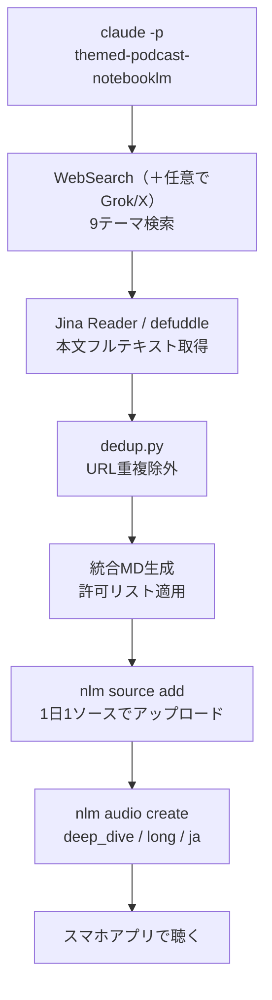
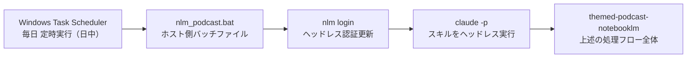

外資コンサルでAIの導入支援をしている、あかりんごです。

仕事では毎日AIの話をしているのに、自分のためのインプットだけはいつも後回し。「あとで読む」に積み上がった記事、消化できていますか？

3歳の娘と1歳の息子を育てています。朝は私が上の子を幼稚園、下の子を保育園へ送り、日中は仕事、夜は風呂と寝かしつけ。自分だけの時間は、子どもたちが起きる前の早朝しか残っていません。

それでも、インプットを止めるわけにはいきません。AIの進化は週単位で動いています。先週の常識が今週には古くなる。知識の更新を怠ると、仕事の判断力が確実に落ちていく——そういう危機感をずっと抱えていました。

試行錯誤はしてきました。Feedlyで数百のRSSフィードを管理し、Google Discoverのアルゴリズムを調整し、Xのリストを何度も作り直しました。それなりに最適化できたはずなのに、積み残しは減らない。

考えてみると当たり前の話でした。「読む」という行為は、スクリーンの前にいる時間を必要とします。情報源をどれだけ絞っても、物理的な上限は変わりません。これは個人の努力の問題ではなく、インプットの**形式**の問題です。

「読む」という形式は、能動的な選択と集中を要求します。スクリーンを開き、記事を選び、目を動かす。移動中・育児中には成立しません。一方で「聴く」は別の認知リソースを使います。早朝に走っている間、皿洗いをしながら、子どもを寝かしつけながら——ながら聴きができます。

「読む」から「聴く」に切り替えれば、インプットできる時間が劇的に増えます。問題は、**自分が追いたいテーマを扱うポッドキャストが存在しない**ことでした。

---

## 自分のテーマに特化したチャンネルは存在しない──だから自分で作ることにした

AIコーディング、Figma×AI、AIスライド自動化、Obsidian×AI。自分が毎日追いたいテーマは具体的にあります。しかしこれらに特化した日本語ポッドキャストは存在しません。

既存のサービスが選んだ情報を聴くことはできます。でもそれは「作り手が選んだ情報」です。自分のテーマのニュースを、自分のためにキュレーションした音声を毎日受け取るには、自分で作るしかありません。

**WebSearchで技術記事を集め、Claude Codeが自動でNotebookLMに投入してAudio Overviewを生成する。** 人間がやることは、追いたいテーマをYAMLファイルに書くだけです。しかも**この基本構成はすべて無料**で回ります。X（旧Twitter）の一次情報まで取り込みたいときだけ、Grok API（従量課金・後述）を足す——という設計にしています。

---

## 10日後、聴くルーティンが自然に定着した

システムを動かし始めて最初の1週間は、「ちゃんと動いているかな」という確認モードでした。スキルが正常に走っているか、NotebookLMにソースが上がっているか、音声が届いているか。

それが変わったのは10日目ごろ。まだ家族が寝ている早朝、ランニングシューズを履いて外に出ると、耳には最新のAIニュースが流れている——という状態が当たり前になっていました。生成は日中に自動で走り、聴くのは翌朝のランニング中。作るタイミングと聴くタイミングを切り離したことで、意識しなくても情報が入ってくる習慣になっていたのです。

今の設計では、その日に収集したニュースをまとめた音声がその日届きます。1日分のキュレーション結果を聴くというシンプルな仕組みで、前日との差分や過去ソースとの横断的な比較は現時点では行っていません。

それでも「また同じ話だな」という感覚はほぼ出ません。追いたいテーマ×その日の最新ニュースを毎日集めてくる以上、内容は自然と更新されます。毎日、昨日とは違う話が用意されるのがこのシステムの前提になっています。

ここまでが「使ってどうだったか」です。ここから、この仕組みを実際にどう組んでいるかを解説します。

---

## 作ったもの：9テーマのAIニュースを毎日自動ポッドキャスト化する



| ツール | 役割 | 費用 |
|--------|------|------|
| Claude Code カスタムスキル | 全体オーケストレーション | — |
| notebooklm-mcp-cli（`nlm.exe`） | NotebookLM操作のCLIラッパー | 無料 |
| Claude Code WebSearch | 技術ブログ・記事の検索 | 無料 |
| defuddle | Web記事本文のMarkdown変換 | 無料 |
| Jina Reader | Web記事・X投稿の本文取得 | 無料枠あり |
| **Grok API（xAI）** | **X（旧Twitter）の最新投稿検索** | **従量課金・任意** |

:::message
**このシステムは基本無料で動きます。** NotebookLMの無料枠・Claude CodeのWebSearch・Jina Readerの無料枠だけで完結します。X（旧Twitter）の一次情報を取り込む部分だけは Grok API（xAI・従量課金）が必要ですが、これは**任意**です。Xソースが要らなければ、APIキーの設定もスキップできます。
:::

ファイル構成はこのようになっています。（`<Vault>/` はルートディレクトリを示します。ご自身の環境に合わせて読み替えてください）

私の場合、このVaultは Obsidian で管理していて、会議の議事録・チャットログ・案件資材をすべて一か所に集めた「外部脳」として運用しています。このVaultの設計と運用の仕組みについては、別記事で詳しく書いています。

@[card](https://zenn.dev/akaringo1109/articles/obsidian-context-continuity)

```
<Vault>/
├── .claude/skills/
│   ├── themed-podcast-notebooklm/   ← スキル本体
│   │   ├── SKILL.md
│   │   └── config.json
│   └── themed-podcast/              ← dedup・テーマ定義などの共有ライブラリ
│       ├── dedup.py
│       ├── search-themes.yaml
│       └── blacklist.json
├── Output/themed-podcast-notebooklm/
│   ├── source_log.json              ← ソースID × 日付の履歴
│   └── sources_filtered_YYYYMMDD.json
├── 05 - Inbox/テーマポッドキャスト/
│   └── YYYY-MM-DD_daily_summary.md  ← NLMへ投入する統合ソース
├── .env
└── nlm_podcast.bat                  ← 後述
```

`themed-podcast/` は検索・dedup・テーマ定義を担う共有ライブラリです。ただしこれは、NotebookLMに移行する前に独自のTTSで音声化していた頃のスキルの名残でもあります。検索・重複除外まわりのロジックを、当時のスキルと今のNotebookLM版とで共有しているために、ディレクトリが2つに分かれています。**これから同じ仕組みをゼロから作るなら、ここを別建てにする必要はありません。検索・dedup・テーマ定義ごと、NotebookLM版のスキル1つにまとめてしまえば十分です**（私の環境が分かれているのは歴史的な経緯によるものです）。

以下、実装の詳細を解説します。

---

## 実装：スキルの構成と処理の流れ

### 初回セットアップ

```powershell
# notebooklm-mcp-cli のインストール
uv tool install notebooklm-mcp-cli
# → %USERPROFILE%\.local\bin\nlm.exe が生成される

# 初回認証（ブラウザが一時起動。以降はヘッドレスで自動更新）
nlm login
```

APIキーを`.env`に設定します。

```
# XAI_API_KEY は「Xの投稿も取り込みたい場合」だけ必要（従量課金・任意）。不要なら未設定でOK
XAI_API_KEY=xai-xxxxxxxxxxxx    # https://console.x.ai/ → API Keys（任意）
JINA_API_KEY=jina_xxxxxxxxxxxx  # https://jina.ai/ → 無料プランあり
```

スキルの設定ファイル（`config.json`）はこれだけ。

```json
{
  "notebook_id": "",
  "audio_format": "deep_dive",
  "audio_length": "long",
  "language": "ja"
}
```

`notebook_id`は初回実行時に自動で埋まります。空のままで実行すれば新規ノートブックを作成してここに書き込みます。2回目以降はそのノートブックに積み上がります。

---

### ステップ1：テーマを定義してWebSearchで情報収集する（Xは任意）

テーマは`search-themes.yaml`でYAML管理します。`enabled: true`のテーマだけが毎日検索されます。

```yaml
themes:
  - label: AI最新動向
    intent: >
      ChatGPT・Claude・Gemini・NotebookLMなど主要AI製品の新機能リリース、
      X上でバズっている使い方、Claude CodeとCodexの連携など話題のワークフロー
    exclude: "LLMのアーキテクチャ詳細、ベンチマークスコア比較、学術論文"
    enabled: true

  - label: AIコーディング
    intent: >
      Claude Code・Codex CLI・CursorのAIエージェント動向、
      実際の開発者がどう使っているかの事例
    exclude: "アーキテクチャ解説、ベンチマーク"
    enabled: true

  # ... 合計9テーマ有効化
```

`intent`は自然言語で書きます。ClaudeがここからGrokクエリとWebSearchキーワードを自律設計します。`exclude`はGrokクエリの設計にも反映されるので、具体的に書くほどノイズが減ります。

各テーマに対してClaudeが情報を集めます。基本は③のWebSearchだけで成立します。①②は**Xの一次情報も取り込みたい場合の任意ステップ**です（Grok APIが従量課金のため）。

**①（任意）Grok APIでX（旧Twitter）の最新投稿を収集**

```powershell
uv run python ".claude\lib\search\grok_search.py" `
  --query "AI関連情報：{intentから展開したクエリ}" `
  --blacklist ".claude\skills\themed-podcast\blacklist.json" `
  --env ".env" `
  --days-back 7 `
  --save-raw
```

**②（任意）Jina ReaderでX投稿の本文を補完**

GrokのAPIが返す`snippet`は投稿の一部しか含まないことがあります。X投稿URLをJina Readerに渡すとスレッド全文・長文投稿をMarkdownで取得できます。

```powershell
curl "https://r.jina.ai/https://x.com/user/status/123456" `
  -H "Authorization: Bearer $jinaKey"
```

**③ WebSearchで技術ブログを検索し、defuddle / Jinaで本文取得**

```powershell
# 優先: defuddle（広告除去・本文抽出）
npx -y defuddle parse "https://example.com/article" --md

# 失敗時フォールバック
curl "https://r.jina.ai/https://example.com/article" `
  -H "Authorization: Bearer $jinaKey"
```

bot遮断やパースエラーでもタイトルとURLだけ記録してスキップし、次のテーマへ継続します。1テーマが失敗しても全体を止めない設計です。

---

### ステップ2：重複を除外して統合MDを作成する

収集した記事は`dedup.py`が管理するURL使用履歴と照合してフィルタリングします。（ポリシーの設計根拠は後述の「設計のポイント」参照）

```powershell
# URL抽出
uv run python ".claude\skills\themed-podcast\dedup.py" `
  extract --date 2026-07-08 `
  --output "Output\themed-podcast-notebooklm\sources_raw_20260708.json"

# 使用済みを除外して許可リストを生成
uv run python ".claude\skills\themed-podcast\dedup.py" `
  filter `
  --sources-file "Output\themed-podcast-notebooklm\sources_raw_20260708.json" `
  --output "Output\themed-podcast-notebooklm\sources_filtered_20260708.json"
```

生成された`sources_filtered_20260708.json`が、次の統合MD作成の許可リストになります。

**統合MDに許可リストを適用する（配信品質の最終防衛ライン）**

当日の全テーマMDを1ファイルに統合するとき、`sources_filtered`の許可リストに残っているURLのブロックだけを残します。filterコマンドで除外記録を取るだけでは不十分で、統合MD本体にも反映しないと既出記事が漏れます。

```markdown
# テーマポッドキャスト — 2026-07-08

---

# AI最新動向 — 2026-07-08 検索結果

## まとめ ...

## X (Twitter) からの情報

### @AnthropicAI（https://x.com/...）
{許可リストに残ったブロックのみ。除外済みURLのブロックは丸ごと落とす}

## Web からの情報
...
```

**`nlm source add` でNotebookLMへアップロード（1日1統合ソース設計）**

```powershell
& nlm `
  source add "<notebook_id>" `
  --file "<Vault>\05 - Inbox\テーマポッドキャスト\2026-07-08_daily_summary.md" `
  --title "2026-07-08 AIトレンド" `
  --wait
```

URLを1件ずつソースとして追加すると9テーマ×5件=45件/日を消費し、Freeプラン（上限50件）は1週間で枯渇します。Claudeが本文取得済みのリッチテキストを1ファイルにまとめることで、情報密度を保ちつつソース消費を1件/日に抑えています。

戻り値の`Source ID`を`source_log.json`に追記します。

---

### ステップ3：NotebookLMへのアップロードと音声生成

`--source-ids`に当日のソースIDのみを渡し、`--focus`（カスタム指示）で生成の方向性を固定します。この2つをセットで使うことで、毎日その日分のニュースに絞った内容が届きます。

**focus_prompt（毎日日付とソースIDを差し替える）**

```
このポッドキャストは日本語で生成してください。

配信日: 2026-07-08
今日追加された新しいソース ID: {today_source_id}
テーマ: AI最新動向, AIコーディング, AIエディタ拡張エコシステム,
        Figma×AI連携, AIスライド自動化, Obsidian×AI,
        クリエイティブ生成AI, AIベンダー公式発表, マーケティング×AI

リスナー像:
- 生成AIの動向を日常的に追っている日本のビジネスパーソン・エンジニア
- MCP・RAG・エージェント・マルチモーダル等のAI用語は前提知識として理解済み
- 用語の定義・解説・例え話は不要

進行方針:
- 今日追加されたソース（ソース ID: {today_source_id}）の内容を軸に構成する
- 各テーマのニュース・動向を一つひとつ深掘りして伝える
- 「このサービス・発表で何ができるか」「業界にどんな影響があるか」を中心に話す
- テーマ間に共通する動きがあれば横断的に言及する
- 15〜20分のポッドキャストとして構成する
```

このfocus_promptは、その日のソースに厳格に絞って音声を生成するための仕組みです。


**① --source-idsで使用ソースを当日分のみに限定する**

`--source-ids`に当日のソースIDだけを渡すことで、NotebookLMが参照するデータをその日の統合MDに絞ります。ノートブックには過去のソースが蓄積されていますが、音声生成はその日分だけを対象にします。

**② focus_promptで生成の方向性を明示する**

ソースIDの指定と合わせて、「今日追加されたソースの内容を軸に構成する」という指示をfocus_promptで明示します。また、リスナー像（用語の前提知識を持つビジネスパーソン・エンジニア）と進行方針をセットで渡すことで、説明過多な入門的内容にならず、その日のニュースを深掘りした内容が出てくるように方向性を固定しています。

この組み合わせで、毎日その日分のニュースに絞った音声を届ける設計にしています。

**生成コマンド**

```powershell
& nlm audio create "<notebook_id>" `
  --format deep_dive `
  --length long `
  --language ja `
  --source-ids "{today_source_id}" `
  --focus "{focus_prompt}" `
  --confirm
```

生成完了まで30秒ごとにポーリング（最大15分）して同期待機します。完了するとNotebookLMアプリに通知が来て再生できる状態になります。

---

## 設計のポイント

### Xを取り込むならGrok経由が効く（任意機能）

情報源はWeb記事が基本で、そこに**任意でXの投稿を足す**2ライン構成です。Web記事は深度があり、技術ブログ・公式ドキュメント・まとめ記事が主役になります。ここにXを足すと速報性が跳ね上がります。新しいツールやモデルのリリースから数分で、エンジニアのリアクションや実用レビューが流れてくるからです。両方が乗ると、速報と解説がひとつの音声にまとまります。

ここで、なぜスクレイピングではなくGrokなのか。XからはGrok API（xAI）を経由して取得しています。機械的にスクレイピングするのではなく、Xのアルゴリズムを把握しているGrokに「AIコーディングの最新トレンド」を投げることで、エンゲージメントの高い関連投稿が返ってきます。`intent`に書いた自然言語がGrokクエリに変換されるため、検索のチューニングをほぼ意識せずに使えます。ブラックボックスな処理が間に入る分、返ってくる結果の詳細な根拠は追えませんが、同等のキーワード検索より鮮度と精度は体感として高いです。ただしGrok APIは従量課金なので、ここは「速報性にコストを払う価値があるか」で判断する任意パートです。無料で回したい人はWeb記事だけでも十分に成立します。


### 重複除外の設計──14日と180日のポリシー

動かし始めて3日目に、同じ記事が違うテーマで2回出てくるのに気づきました。そのままにしておくとポッドキャストで「さっきも聴いたな」が頻発しそうだったので、重複排除の仕組みを入れることにしました。

収集した記事はそのままNotebookLMに流しません。同じ記事が複数テーマでヒットすることがあります。また人気のエバーグリーン記事は毎週WebSearchの上位に出続けます。これをそのまま流すと、ポッドキャストで同じ記事が繰り返し紹介されます。

`dedup.py`がURL単位で使用履歴を管理し、ポリシーに従ってフィルタリングします。

| ソース種別 | 除外スコープ | 除外期間 |
|-----------|-------------|---------|
| Xの投稿 | 同テーマ内 | 14日間 |
| Web記事 | テーマ横断（全体） | 180日間 |

Web記事をテーマ横断・180日除外にした理由は、同テーマ14日除外では「テーマをまたいで」または「14日後に」同じ記事が再登場するためです。一度紹介した記事は半年間どのテーマでも出さない設計にしました。


### スケジュール実行の設計──一部の機能が制限された環境での工夫

Claude Codeには`/cron`コマンドや`ScheduleWakeup`など、スキルを定期実行するための仕組みがあります。ただし、環境によっては、こうしたスケジュール機能やループ系のコマンドが利用できないことがあります。私の手元もそうした制約のある環境なので、その中で成立する形に寄せました。

そのため、スケジュール実行の仕組みをClaude Codeの外側——ホスト（Windows）側——に持ち出すことにしました。**バッチファイルを作成し、それをWindows Task Schedulerに登録する**という構成です。

Claude Codeのスキル自体はあくまで「呼ばれたときに動く」単一の処理として設計されていて、`claude -p`コマンドでヘッドレス実行できます。定期実行のトリガーはホスト側が持ちます。この役割分担により、Claude Code側の設計をシンプルに保てます。

補足として、`claude -p`（print モード）はClaude Codeを**非対話のワンショットで動かす**実行形態です。プロンプトを1つ渡すと、対話セッションを開かずにその指示だけを実行し、結果を返してそのまま終了します。普段のClaude Codeは対話UIで使いますが、`-p`を付けると**スクリプトやバッチから呼び出せるコマンド**になります。処理ごとにバッチファイルを分けて用途別に走らせる、といった運用と相性がよく、意外と知られていない便利な使い方です。今回は「毎日のポッドキャスト生成」を1つのバッチに閉じ込めていますが、同じ要領で別の定型処理を別バッチに切り出していけば、Claude Codeを“無人の実行エンジン”として横展開できます。



#### nlm_podcast.bat の3つのポイント

**① nlm loginをプリフライトとして毎回実行する**

```batch
set "NLM_CMD=%USERPROFILE%\.local\bin\nlm.exe"
"%NLM_CMD%" login >> "%LOGFILE%" 2>&1
if errorlevel 1 (
    echo [ERROR] nlm login failed.
    endlocal & exit /b 1
)
```

毎回`nlm login`を実行するのは、Googleセッションを能動的に更新するためです。ヘッドレスで完結し（保存済みChromeプロファイルを使用）、認証エラーがあれば早期終了してログに残ります。

**② claude -p の起動（フラグ2つが重要）**

```batch
call "%CLAUDE_CMD%" -p ^
  "/themed-podcast-notebooklm (headless mode)" ^
  --strict-mcp-config --mcp-config "{\"mcpServers\":{}}" ^
  --permission-mode bypassPermissions ^
  2>&1 | powershell -NoProfile -Command ^
    "[Console]::OutputEncoding = [Text.Encoding]::UTF8; ^
     $input | Tee-Object -FilePath '%LOGFILE%' -Append"
```

`--strict-mcp-config --mcp-config '{"mcpServers":{}}'` でMCPサーバーの起動ハングを防ぎます。WebSearchはClaude Code組み込みツールなので引き続き使えます。

`--permission-mode bypassPermissions` で対話的な権限確認プロンプトをスキップします。環境によっては`--dangerously-skip-permissions`が無効化されていることがあり、その場合はこちらで代替できます。

**③ source_log.jsonで完了を確認する**

```batch
findstr /C:"%today%" "%SOURCE_LOG%" >NUL 2>&1
if errorlevel 1 (
    echo [WARN] No entry for %today% in source_log.json
) else (
    echo [OK] source_log.json confirmed entry for %today%.
)
```

Audio生成はNotebookLMのサーバーサイドなのでこちら側では確認できません。`source_log.json`に当日エントリがあれば、少なくともアップロードは成功していると判断できます。

---

## うまくいかなかったこと：全蓄積ソースを渡して「昨日との差分」を出す

正直に書いておきます。最初に思い描いていた設計は、今の実装とは少し違うものでした。

当初の発想は「蓄積が進むほどNotebookLMが変化を語れるようになる」というものです。音声生成時に全蓄積ソースIDを`--source-ids`に渡し、focus_promptで今日の新情報と過去の変化を比較させる設計でした。

focus_promptにはこんな指示を入れていました。

```
進行方針:
- 今日追加されたソース（ソース ID: {today_source_id}）の内容を軸に構成する
- 過去ソースと今日のソースを比較して変化が見られる場合は
  「昨日と比べて」「最近のトレンドとして」などと言及する
- 今日のソースに新しい動きがないテーマは短くまとめ、
  新情報があるテーマに時間を割く
```

「今週のAnthropicは先週のCodexリリースを意識した動きをしている」——こういう横断的な分析が毎日出てくる状態が目標でした。

**結果：毎日似た内容になった。**

NotebookLMはfocus_promptの指示より、渡された全蓄積データの「共通して登場するテーマ」を優先して拾う挙動でした。ソースが積み上がるほど「よく出るテーマのダイジェスト」になり、今日のニュースではなく過去の重要テーマの焼き直しが届くようになっていきました。

現在はv0.5.0として、`--source-ids`に当日分だけを渡す設計に切り替えています。「昨日との差分を出す」という当初のアイデアは実現できていない状態です。ただ、毎日フレッシュな内容が届くという最低限の要件は満たせています。

cross-day diffの実現については、直近N日分のみを渡す・前日以前のソースIDを除外して渡す、といった別のアプローチも検討中です。NotebookLMのfocusパラメーターの挙動が変われば、また試してみたいと思っています。

---

## 運用上の制約

| プラン | ソース上限 | 運用可能期間 |
|--------|-----------|-------------|
| Free | 50件/ノートブック | 約50日 |
| Ultra | 600件/ノートブック | 約1.5年 |

上限に近づいたら古いソースを削除するか、新ノートブックを作成して`config.json`の`notebook_id`を更新します。移行はJSONの1フィールドを書き換えるだけです。

- **Googleセッションの失効**：長期間ブラウザを開かないとGoogle認証が失効することがあります。`nlm login`が失敗するようになったら手動で再認証が必要です
- **Task SchedulerはユーザーログオンでOAuth認証が機能する**：「ユーザーがログオン中のときのみ実行」の設定にすること

---

## おわりに

今は毎朝、家族がまだ眠っている早朝に走りに出ると、耳には最新のポッドキャストが流れています。生成は日中に自動で回り、聴くのは翌朝——このズレがちょうどいい。「また同じ話だな」という感覚が消えて、「今日はどんな話が来るんだろう」という感覚に変わりました。インプットが義務から楽しみになった、というのが正直な実感です。

情報収集の問題を「もっと読む努力」で解決しようとすると、処理量の上限に必ずぶつかります。「読む」という形式が持つ構造的な制約があるからです。

この仕組みが変えたのは、その形式です。「聴く」に変えることで、スクリーンを開けない時間がインプット時間に変わりました。テーマをYAMLに書くことで、追いたい情報が毎日自動でキュレーションされ、音声になって届きます。

子育てしながら情報収集に悩んでいる方、時間が足りなくて「あとで読む」が永遠に消化できない方——同じ問題を抱えているなら、追いたいテーマをYAMLに書くところから試してみてください。

この「外からのニュースを聴く」仕組みとは別に、Gemini TTSを使って「自分の今日の活動」をプロジェクト単位で振り返る、日次・週次のポッドキャストも自作しています（`daily-audio-script` / `weekly-audio-script`）。外からの情報を聴く×自分の活動を聴く、この2軸が揃うと、早朝や家事のあいだのすき間時間の使い方がかなり変わります。こちらは別記事で詳しく紹介します。

---

**関連記事**

@[card](https://zenn.dev/akaringo1109/articles/obsidian-context-continuity)

@[card](https://zenn.dev/akaringo1109/articles/visualize-ai-thinking-with-nano-banana)

「今日何したっけ」が音声で届く──Claude Code + Gemini TTS で日次・週次振り返りポッドキャストを自作した（近日公開予定）
